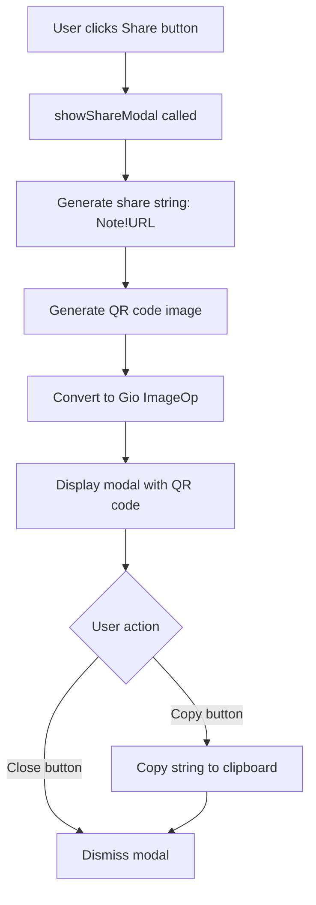

# Subscription Share Feature Implementation Plan

## Overview
Implement a subscription share feature that displays a modal with a QR code when the share button is clicked. The QR code encodes a string in the format `s.Note!s.URL`, and the modal also includes a button to copy this string to the clipboard.

## Current State Analysis

### Existing Components
- **[`SubscriptionsPage`](internal/adapters/driving/gioui/windows/subscriptions_window.go:25)** - Already has share button handling at lines 81-83 (empty)
- **[`showEditor`](internal/adapters/driving/gioui/windows/subscriptions_window.go:147)** - Reference implementation for modal pattern
- **[`appwidgets.Modal`](internal/adapters/driving/gioui/appwidgets/modal.go:19)** - Reusable modal component
- **[`domain.Subscription`](internal/core/domain/models.go:24)** - Contains `Note` and `URL` fields

### Share String Format
```
s.Note!s.URL
```
Example: `My Subscription!https://example.com/subscribe`

## Implementation Steps

### Step 1: Add Dependencies
Add the QR code library to `go.mod`:
```
github.com/yeqown/go-qrcode/v2
```

Run:
```bash
go get github.com/yeqown/go-qrcode/v2
```

### Step 2: Add Share Modal State Fields
Add new fields to [`SubscriptionsPage`](internal/adapters/driving/gioui/windows/subscriptions_window.go:25) struct:

```go
// Share modal state
shareModal      *appwidgets.Modal
shareQRCode     image.Image       // Cached QR code image
shareQRCodeOp   paint.ImageOp     // Gio image operation
shareString     string            // Current share string
shareCopyBtn    widget.Clickable  // Copy button
shareCloseBtn   widget.Clickable  // Close button
```

### Step 3: Initialize Share Modal
Update [`NewSubscriptionsPage`](internal/adapters/driving/gioui/windows/subscriptions_window.go:46) to initialize the share modal:

```go
func NewSubscriptionsPage(router *Router, c ports.Configuration) *SubscriptionsPage {
    // ... existing code ...
    p := &SubscriptionsPage{
        // ... existing fields ...
        shareModal: appwidgets.NewModal(),
    }
    // ... rest of initialization ...
}
```

### Step 4: Implement QR Code Generation Helper
Create a helper function to generate QR code as `image.Image`:

```go
import (
    "github.com/yeqown/go-qrcode/v2"
    "github.com/yeqown/go-qrcode/writer/standard"
)

func generateQRCode(data string) (image.Image, error) {
    qr, err := qrcode.New(data)
    if err != nil {
        return nil, err
    }
    
    // Create in-memory image
    img := standard.NewWithWriter(standard.ToImage())
    err = qr.Save(img)
    if err != nil {
        return nil, err
    }
    
    return img.Image(), nil
}
```

### Step 5: Implement showShareModal Method
Create a method similar to [`showEditor`](internal/adapters/driving/gioui/windows/subscriptions_window.go:147):

```go
func (p *SubscriptionsPage) showShareModal(gtx layout.Context, s domain.Subscription) {
    // Generate share string
    p.shareString = s.Note + "!" + s.URL
    
    // Generate QR code
    img, err := generateQRCode(p.shareString)
    if err != nil {
        // Handle error - maybe show error message
        return
    }
    
    // Convert to Gio paint.ImageOp
    p.shareQRCodeOp = paint.NewImageOp(img)
    
    // Show modal
    p.shareModal.Show(gtx, p.shareModalContent)
}

func (p *SubscriptionsPage) shareModalContent(gtx layout.Context, th *material.Theme) layout.Dimensions {
    // Handle button clicks
    if p.shareCloseBtn.Clicked(gtx) {
        p.shareModal.Dismiss(gtx)
    }
    
    if p.shareCopyBtn.Clicked(gtx) {
        p.copyShareString(gtx)
    }
    
    // Layout: Title, QR Code, Share String, Copy Button, Close Button
    gtx.Constraints.Max.X = gtx.Dp(400)
    return layout.UniformInset(style.DefaultMargin).Layout(gtx, func(gtx layout.Context) layout.Dimensions {
        return layout.Flex{Axis: layout.Vertical}.Layout(gtx,
            // Title
            layout.Rigid(material.H6(th, "Share Subscription").Layout),
            layout.Rigid(layout.Spacer{Height: style.DefaultMargin}.Layout),
            // QR Code
            layout.Rigid(func(gtx layout.Context) layout.Dimensions {
                img := p.shareQRCodeOp
                return img.Layout(gtx)
            }),
            layout.Rigid(layout.Spacer{Height: style.DefaultMargin}.Layout),
            // Share String (readable text)
            layout.Rigid(material.Body1(th, p.shareString).Layout),
            layout.Rigid(layout.Spacer{Height: style.DefaultMargin}.Layout),
            // Buttons
            layout.Rigid(func(gtx layout.Context) layout.Dimensions {
                return layout.Flex{}.Layout(gtx,
                    layout.Flexed(1, appwidgets.MaterialButton(th, &p.shareCopyBtn, "Copy", nil, "").Layout),
                    layout.Rigid(layout.Spacer{Width: style.DefaultMargin}.Layout),
                    layout.Flexed(1, appwidgets.MaterialButton(th, &p.shareCloseBtn, "Close", nil, "").Layout),
                )
            }),
        )
    })
}
```

### Step 6: Handle Share Button Click
Update the share button click handler in [`renderItem`](internal/adapters/driving/gioui/windows/subscriptions_window.go:73):

```go
if item.Share.Clicked(gtx) {
    p.showShareModal(gtx, s)
}
```

### Step 7: Implement Copy Functionality
Add clipboard copy function:

```go
import (
    "io"
    "strings"
    "gioui.org/io/clipboard"
)

func (p *SubscriptionsPage) copyShareString(gtx layout.Context) {
    go func() {
        gtx.Execute(clipboard.WriteCmd{Data: io.NopCloser(strings.NewReader(p.shareString))})
    }()
}
```

### Step 8: Add Modal Layout Call
Ensure the share modal is rendered in [`Layout`](internal/adapters/driving/gioui/windows/subscriptions_window.go:64) method (after the existing modal layout):

```go
// At the end of Layout method, after p.modal.Layout(gtx, th)
p.shareModal.Layout(gtx, th)
```

## Required Imports
Add these imports to [`subscriptions_window.go`](internal/adapters/driving/gioui/windows/subscriptions_window.go:1):

```go
import (
    "image"
    "io"
    "strings"
    
    "gioui.org/io/clipboard"
    "gioui.org/layout"
    "gioui.org/op/paint"
    "gioui.org/widget"
    "gioui.org/widget/material"
    "gioui.org/x/component"
    "golang.org/x/exp/shiny/materialdesign/icons"
    
    "github.com/yeqown/go-qrcode/v2"
    "github.com/yeqown/go-qrcode/writer/standard"
    
    "github.com/bluegradienthorizon/singtoolboxgui/internal/adapters/driving/gioui/appwidgets"
    "github.com/bluegradienthorizon/singtoolboxgui/internal/adapters/driving/gioui/style"
    "github.com/bluegradienthorizon/singtoolboxgui/internal/core/domain"
    "github.com/bluegradienthorizon/singtoolboxgui/internal/core/ports"
)
```

## Architecture Diagram



## UI Layout

```
┌─────────────────────────────────┐
│       Share Subscription        │  <- Title
├─────────────────────────────────┤
│                                 │
│         ┌───────────┐           │
│         │  QR CODE  │           │  <- QR Code image
│         │   IMAGE   │           │
│         └───────────┘           │
│                                 │
├─────────────────────────────────┤
│   My Subscription!https://...   │  <- Share string text
├─────────────────────────────────┤
│   ┌────────┐   ┌────────┐       │
│   │  Copy  │   │ Close  │       │  <- Action buttons
│   └────────┘   └────────┘       │
└─────────────────────────────────┘
```

## Testing Considerations
1. Verify QR code encodes correct string format
2. Test clipboard copy functionality
3. Test modal open/close behavior
4. Test with various Note and URL combinations
5. Verify QR code is scannable

## Files to Modify
- [`go.mod`](go.mod) - Add go-qrcode dependency
- [`internal/adapters/driving/gioui/windows/subscriptions_window.go`](internal/adapters/driving/gioui/windows/subscriptions_window.go) - Main implementation
